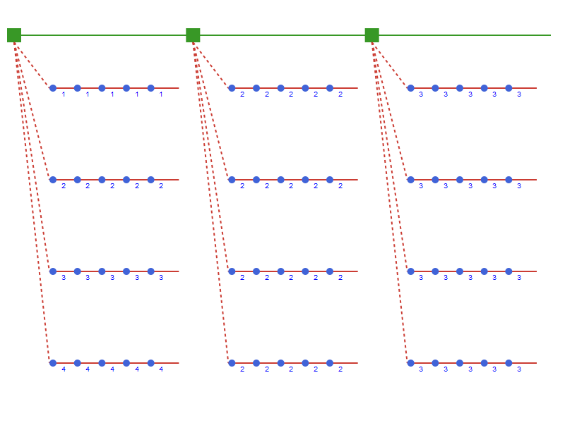

# TimeStructVisualizer

## Overview
This package provides functions for visualising time structures from the `TimeStruct.jl` package.
The plots are created using the Luxor package and can be displayed or stored in various formats.

## Usage

The example below shows how one can visualise a time structures with two levels.

```julia
using TimeStruct
using TimeStructVisualizer

ts = TwoLevel(3, 52, OperationalScenarios(4, SimpleTimes(5,1)))

cost = StrategicProfile(
    [
        ScenarioProfile([1, 2, 3, 4]),
        FixedProfile(2),
        FixedProfile(3)
    ]
)

draw(ts; profile = cost, layout=:top)

```

This will produce the following figure

